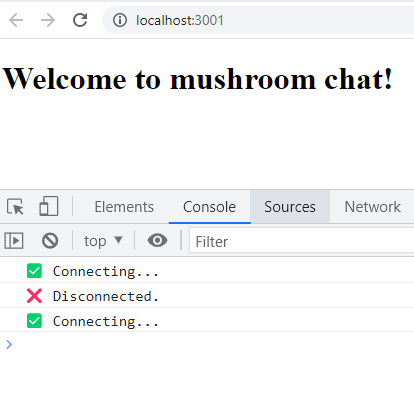

  <h1>Cleanup Functions</h1>
  

    This repository is about using a cleanup function inside a useEffect 
  

### Important points to consider

- The component will <strong>mount, unmount</strong> then <strong>remount</strong> because of <strong>strict mode</strong> which helps developers find bugs early in the development process.

